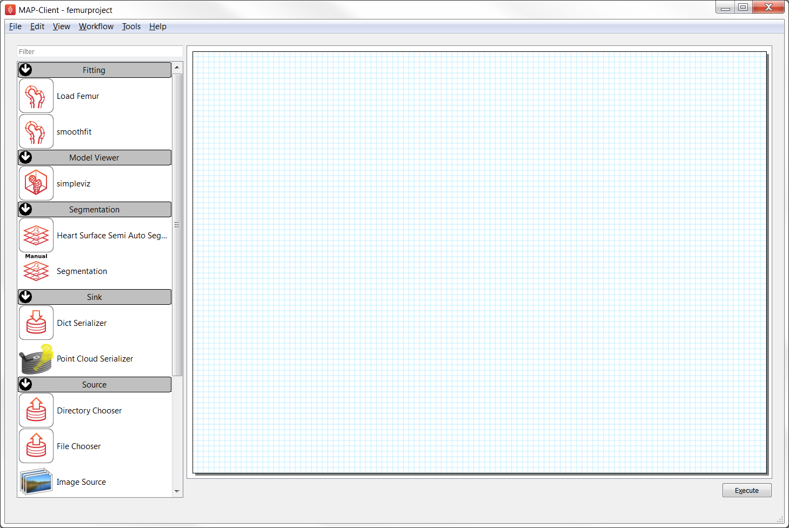
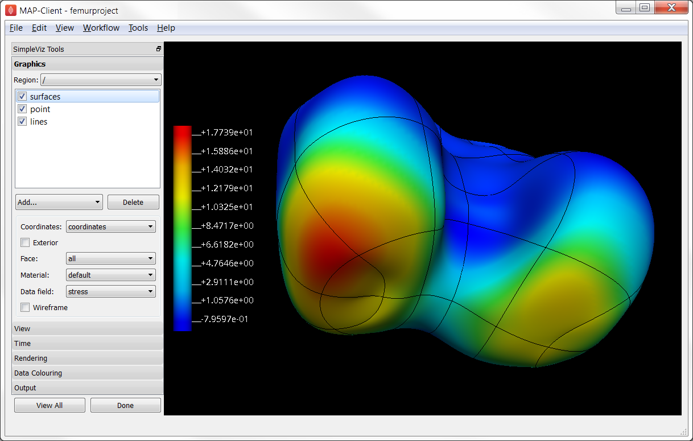

.. _dtp_cp_project_femurfitting:

Project: Femur Fitting
======================

This project was created as part of the Computational Physiology module in the `MedTech CoRE 
<http://medtech.org.nz>`_ Doctoral Training Programme. 

This project requires you to put together what you have learned in the tutorials to define a complete workflow which will create a customised model of the end of a femur bone by fitting it to medical images, perform some computational simulation with it and visualise the result.

Outline
-------

You will need to start MAP Client and create a new workflow via the menu item  :menuselection:`File --> New --> Workflow`. This just requires you to select a folder: create a new, empty folder, for example "femurproject" on the Desktop, and select it.

At this point the MAP Client interface will show a blank project and a list of plugins you can use, as shown in :numref:`fig_dtp_cp_blankfemurproject`:

.. _fig_dtp_cp_blankfemurproject:

   The MAP Client interface showing some of the plugins to use in this project. (Note that your version should have additional plugins.)

For this project you will use the following plugins for steps in the workflow:

* **Image Source** - for selecting a folder of images to digitise
* **Segmentation (Manual)** - for digitising points in the image stack for segmenting the femur surface
* **Create Hemisphere Model** - for constructing a template mesh to fit to the femur data
* **smoothfit** - for fitting the input model to the digitised points
* **Load Femur** - for performing some heavy math on the fitted model
* **simpleviz** - for visualising the results

These are added to your workflow by dragging them into the working area (with the blue grid, like graph paper). Each step must be configured by clicking on its gear-shaped settings icon, which is initially red but changes to green when correctly configured. At a minimum you must give each step a unique name in this workflow (intermediate data is saved under this name), and set any other options for sources to the workflow. You will need to connect the input and output ports for each step.

Tips for completing the project
-------------------------------

* For initial input to the Segmentation tool you will want to select folder  ``DTP-data/complete_workflow/knee_mri`` (the location of the ``DTP-data`` folder will be given to you).
* When digitising points on the medical images, make sure you create adequate points to define the curved surfaces: it's easy to underspecify the shape at the end of rounded body. You may wish to rotate the plane you're digitising on to suit capturing the femur shape. It takes a while to digitise so routinely save the data, and a final time before clicking 'done'. Next time you run the workflow you can click 'load' to reload it.
* You *must* configure the Create Hemisphere Model step with 12 elements around, 3 elements up and 1 element along stem to work with this project. With this number of elements you'll need plenty of high quality digitised points, and careful use of the strain penalty when fitting!
* The smoothfit step has 3 inputs: the top one is the initial model, the bottom one is a cloud of data points (as output by the Segmentation tool). The middle one is unused here as it used as an alternative data point cloud, read from an EX format file. Be sure to save your final transformation so you can re-load it next time the workflow is run.
* Note it takes a few seconds to perform each fit iteration, and a similar amount of time to perform the Load Femur maths. Be patient; the interface for the next step will display when ready.
* When initially visualising you will see nothing! Create surfaces and try to view the stress on it. Add a colour bar and try creating some other graphics. Save the resulting image.

Your final visualisation will look something like :numref:`fig_dtp_cp_femurprojectvisualisation`:

.. _fig_dtp_cp_femurprojectvisualisation:

   Visualisation of the final result of the femur project. Your result may use different graphics, and will differ because your digitisation and fitting will always make a unique result.

Scoring
-------

The tutors will give a score out of 10 based on both how realistic the final femur shape is, and how attractive the output image is (tip: choose visualisation settings maximise quality, and think about balance of the image). You may re-run the workflow to add or fix the digitised points (be sure to load the current ones first!), improve fitting etc. to try to increase your score.
